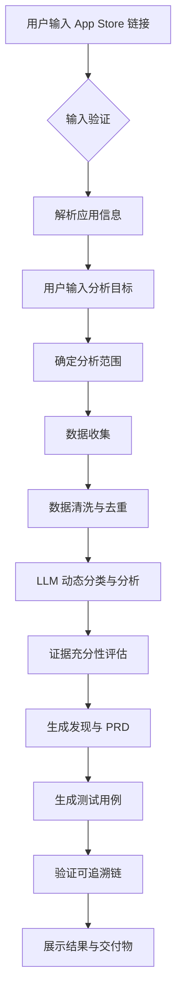
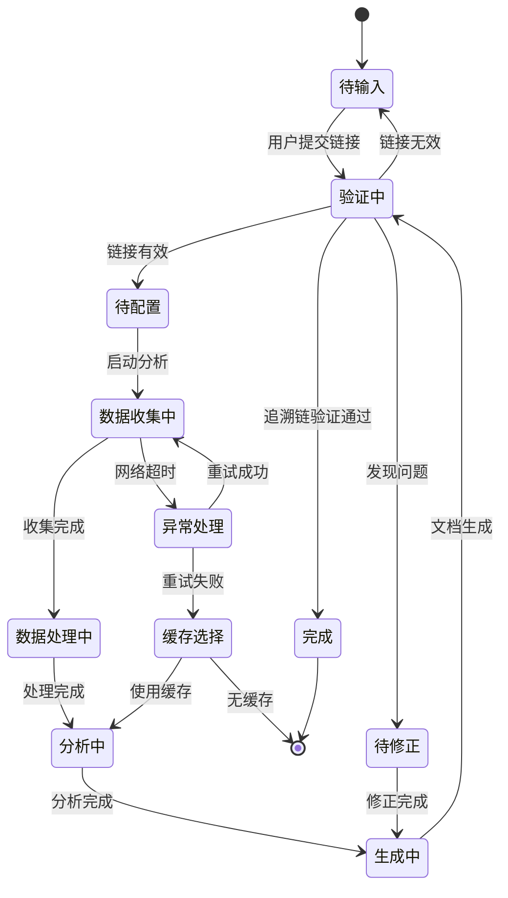
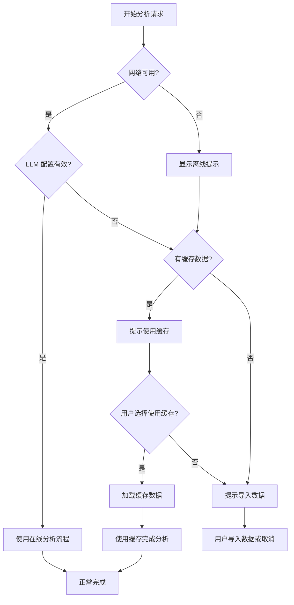

# 应用评审分析工具 - 需求拆解文档

## 需求名称：App Review Insight - 应用商店评价智能分析平台

---

## 1. 价值探索与分析

### 1.1 业务背景与目标

**核心痛点**：产品经理、研发团队在分析 App Store 用户评价时面临三大挑战：
- **数据分散**：评价数据量大且非结构化，人工整理耗时（单应用评价可能数千条）
- **结论主观**：人工分析依赖个人经验，缺乏系统性的分类和证据链
- **落地困难**：从"发现问题"到"生成需求文档和测试用例"存在巨大断层

**产品目标**：构建一个端到端的自动化分析流水线，实现从"输入 App Store 链接"到"输出 PRD 和测试用例"的全流程自动化，帮助团队将分析时间从**数天压缩到数分钟**。

**核心设计原则**：
- **动态分类**：不依赖硬编码的类别、关键词映射或预设问题分类法，系统应根据实际评价内容动态生成分类
- **用户驱动**：分析目标由用户自由输入，系统基于用户目标和数据特征确定分析范围
- **可追溯性**：所有结论必须可追溯到原始评价，无根据的结论必须删除、修正或标记为假设

### 1.2 用户角色与场景

| 用户角色 | 核心场景 | 使用频率 |
|---------|---------|---------|
| 产品经理 | 竞品分析、用户反馈分析、需求优先级排序 | 高（每周 3-5 次） |
| 研发工程师 | 了解用户痛点、获取测试用例参考 | 中（每月 5-10 次） |
| QA 工程师 | 获取真实场景测试用例、追溯问题来源 | 中（每月 3-5 次） |
| 市场分析师 | 分析市场口碑、竞品对比 | 低（每月 1-2 次） |

### 1.3 核心业务逻辑



---

## 2. 用户故事与验收标准

### 2.1 核心用户故事

#### US-01: 链接输入与验证

> **用户故事**：作为产品经理，我想要输入一个有效的 App Store 链接，以便于系统能自动识别并开始分析流程。

**验收标准（Gherkin）**：
- **正常场景**：
  - Given 用户位于首页
  - When 用户输入有效的 App Store US 链接（如 `https://apps.apple.com/us/app/.../id123456789`）
  - Then 系统应在 3 秒内解析出应用名称、开发者、Bundle ID 等基本信息
  - And 显示应用预览卡片，供用户确认

- **异常场景1 - 无效链接**：
  - Given 用户位于首页
  - When 用户输入非 App Store 链接或格式错误的链接
  - Then 系统应立即显示错误提示："请输入有效的美国 App Store 应用链接"

- **异常场景2 - 非美国区链接**：
  - Given 用户位于首页
  - When 用户输入其他地区的 App Store 链接
  - Then 系统应提示："当前仅支持美国区 App Store 应用分析"

#### US-02: 分析目标配置（动态目标输入）

> **用户故事**：作为产品经理，我想要自由描述我的分析目标，以便系统能根据我的关注点动态调整分析策略。

**验收标准（Gherkin）**：
- **正常场景**：
  - Given 用户已输入有效的应用链接
  - When 用户在目标输入框中自由描述分析目标（如"关注订阅转化率、分析锻炼课程可用性、找出低评分评价的核心问题"）
  - Then 系统应保存用户的自由文本目标
  - And 系统应基于用户目标动态确定分析维度（而非使用预设选项）

- **异常场景1 - 目标为空**：
  - Given 用户未输入任何分析目标
  - When 用户尝试开始分析
  - Then 系统应使用默认分析目标（全面分析用户反馈）
  - And 提示"未指定特定目标，将进行全面分析"

- **异常场景2 - 目标过于宽泛**：
  - Given 用户输入的目标过于宽泛（如"分析这个应用"）
  - When 系统接收到目标
  - Then 系统应提示用户缩小范围或使用默认推荐

#### US-03: 数据收集与进度展示

> **用户故事**：作为产品经理，我想要实时查看数据收集和分析进度，以便于了解当前状态并预估完成时间。

**验收标准（Gherkin）**：
- **正常场景**：
  - Given 分析流程已启动
  - When 系统执行数据收集、清洗、分析等各阶段
  - Then 进度面板应实时显示当前阶段、已完成百分比、预估剩余时间
  - And 每个阶段完成后展示中间结果摘要

- **异常场景1 - 网络超时**：
  - Given 数据收集阶段正在进行
  - When App Store 接口响应超时（>30秒）
  - Then 系统应显示警告并自动重试最多 3 次
  - And 若重试失败，提供"使用缓存数据"选项

- **异常场景2 - 部分数据缺失**：
  - Given 数据收集完成
  - When 某些评价因权限或其他原因无法获取
  - Then 系统应在结果中标注缺失数据的数量和原因
  - And 继续分析已获取的数据

#### US-04: 动态智能分类与发现生成

> **用户故事**：作为产品经理，我想要系统自动对评价进行动态分类并生成关键发现，以便于快速识别用户痛点和改进机会。

**验收标准（Gherkin）**：
- **正常场景**：
  - Given 数据清洗已完成
  - When 系统执行 LLM 动态分类分析
  - Then 系统应基于评价内容自动生成有意义的主题分类（非预设类别）
  - And 分类名称应反映评价的实际内容（如"会员费用疑虑"、"追踪器同步问题"等动态生成的名称）
  - And 生成 Top 5 关键发现，每个发现附带支持的用户评价原文

- **异常场景1 - 分类结果模糊**：
  - Given 某些评价内容简短或语义模糊
  - When 系统无法确定分类
  - Then 系统应将其归类为"其他/待人工审核"
  - And 在分类结果中标注低置信度条目

- **异常场景2 - 发现相互矛盾**：
  - Given 分析过程中发现矛盾反馈（如同时有"应用很流畅"和"应用卡顿严重"）
  - When 系统检测到矛盾
  - Then 系统应在发现列表中标注矛盾点
  - And 展示支持双方观点的评价数量和示例

#### US-05: PRD 与测试用例生成

> **用户故事**：作为产品经理，我想要系统基于分析结果自动生成 PRD 文档和测试用例，以便于快速启动开发和测试工作。

**验收标准（Gherkin）**：
- **正常场景**：
  - Given 分析发现已生成并通过验证
  - When 用户点击"生成 PRD 和测试用例"
  - Then 系统应输出结构化的 PRD 文档（含需求描述、优先级、用户故事）
  - And 为每个需求生成至少 2 个测试用例（正向 + 异常场景）
  - And 每个测试用例应追溯到具体的用户评价来源

- **异常场景1 - 需求过多**：
  - Given 分析发现超过 20 条
  - When 系统生成 PRD
  - Then 系统应建议按优先级拆分为多个版本
  - And 提供版本划分建议（V1 核心需求 / V2 增强功能）

- **异常场景2 - 生成质量不足**：
  - Given 某些发现的证据支撑不足
  - When 系统验证可追溯链
  - Then 系统应将这些需求标记为"待确认"
  - And 不生成对应的测试用例，直到用户确认

#### US-06: 结果导出与追溯

> **用户故事**：作为产品经理，我想要导出分析结果并能追溯每个结论的来源，以便于与团队沟通和存档。

**验收标准（Gherkin）**：
- **正常场景**：
  - Given 分析流程已完成
  - When 用户点击"导出结果"
  - Then 系统应支持导出以下内容：原始评价（CSV）、分析报告（PDF/Markdown）、PRD 文档、测试用例（Excel）
  - And 每个导出文件应包含时间戳和应用标识

- **异常场景1 - 大文件导出**：
  - Given 分析包含超过 1000 条评价
  - When 用户导出 CSV
  - Then 系统应显示导出进度
  - And 导出完成后提供下载链接（保留 24 小时）

- **异常场景2 - 追溯链断裂**：
  - Given 某些分析结论未关联到具体评价
  - When 用户查看追溯链
  - Then 系统应高亮标记断裂点
  - And 提示用户补充证据或删除无根据的结论

#### US-07: 离线模式与数据导入

> **用户故事**：作为产品经理，我想要在网络不可用时导入已有的评价数据进行分析，以便于在任何环境下都能使用该工具。

**验收标准（Gherkin）**：
- **正常场景**：
  - Given 用户处于离线状态或不想从 App Store 爬取
  - When 用户上传符合格式要求的 JSON/CSV 文件
  - Then 系统应解析文件并进入分析流程
  - And 显示导入的数据统计（条数、时间范围、评分分布）

- **异常场景1 - 格式错误**：
  - Given 用户上传了格式不正确的文件
  - When 系统验证文件格式
  - Then 系统应显示具体的格式错误信息
  - And 提供示例文件下载链接

- **异常场景2 - 数据不完整**：
  - Given 用户上传的文件缺少必要字段（如评价内容、评分）
  - When 系统进行数据验证
  - Then 系统应标记缺失字段的条目数量
  - And 询问用户是否继续分析或中止

#### US-08: 缓存数据复用

> **用户故事**：作为产品经理，我想要在网络或 LLM 服务不可用时使用缓存数据查看结果，以便在演示环境中也能展示完整功能。

**验收标准（Gherkin）**：
- **正常场景 - 使用缓存**：
  - Given 系统检测到网络或 LLM 服务不可用
  - When 用户有该应用的缓存数据
  - Then 系统应提示"检测到缓存数据，是否使用？"
  - And 使用缓存数据完成分析流程
  - And 在界面上明确显示"当前使用缓存数据"标识

- **异常场景 - 缓存过期**：
  - Given 缓存数据已超过有效期（7天）
  - When 用户尝试使用缓存
  - Then 系统应警告"缓存数据可能已过期"
  - And 询问用户是否仍要使用

- **异常场景 - 无缓存**：
  - Given 系统不可用且无缓存数据
  - When 用户尝试分析
  - Then 系统应提示"当前服务不可用，请稍后重试或导入本地数据"

---

## 3. 详细功能逻辑

### 3.1 功能模块划分

```
┌─────────────────────────────────────────────────────────────┐
│                    App Review Insight                        │
├─────────────┬──────────────┬──────────────┬─────────────────┤
│  输入配置层  │   数据层      │   分析层      │    展示层        │
├─────────────┼──────────────┼──────────────┼─────────────────┤
│ · 链接验证   │ · 爬虫服务    │ · LLM 动态   │ · 进度面板       │
│ · 目标输入   │ · 数据清洗    │   分类引擎    │ · 结果可视化     │
│ · 数据导入   │ · 缓存管理    │ · 发现引擎    │ · 追溯链展示     │
│             │ · 存储服务    │ · PRD 生成    │ · 导出服务       │
│             │              │ · 测试用例    │                 │
└─────────────┴──────────────┴──────────────┴─────────────────┘
```

### 3.2 核心流程状态机



### 3.3 详细流程说明

#### 3.3.1 输入与配置模块

**前置条件**：用户访问系统首页（无需登录）

**主流程**：
1. 用户在输入框粘贴 App Store US 应用链接
2. 前端验证链接格式（正则匹配 `https://apps.apple.com/us/app/.+/id\d+`）
3. 发送链接到后端验证接口
4. 后端调用 App Store 服务获取应用元数据（名称、开发者、图标、价格、分类）
5. 返回应用信息卡片供用户确认
6. 用户输入分析目标（**自由文本，非预设选项**）：
   - 目标输入框：用户可自由描述关注点
   - 示例提示："关注订阅转化率和用户付费体验"、"分析锻炼课程可用性问题"
   - 系统将用户目标保存后，由 LLM 动态确定分析维度
7. 用户设置筛选条件（**仅有基础筛选，无预设分析维度**）：
   - 评分筛选：全部、1星、2星、3星、4星、5星
   - 时间范围：全部、最近1个月、最近3个月、最近6个月、自定义
   - 版本筛选：全部版本、仅最新版本、指定版本范围
8. 用户点击"开始分析"或"使用默认配置快速分析"

**后置条件**：分析任务创建成功，进入数据收集阶段

#### 3.3.2 数据收集模块

**前置条件**：分析任务已创建，用户已确认配置

**主流程**：
1. 根据配置构建 API 请求参数
2. 使用 App Store RSS Feed API 或 Web Scraping 收集评价数据
3. 分页获取所有符合条件的评价
4. 对每条评价记录收集时间戳
5. 检查是否达到配置的筛选条件（评分、时间、版本）
6. 保存原始数据到临时存储
7. 生成数据收集报告（收集条数、过滤条数、耗时）
8. 同时将数据保存到缓存（标识为 `cache_{bundle_id}_{timestamp}`）

**后置条件**：原始评价数据已收集并存储

#### 3.3.3 数据清洗与结构化模块

**前置条件**：原始数据收集完成

**主流程**：
1. 去除重复评价（按评价 ID 去重）
2. 处理空值和异常值：
   - 移除空内容评价
   - 修正评分字段格式
3. 文本预处理：
   - 去除 HTML 标签
   - 统一编码格式
   - 处理特殊字符
4. 结构化处理：
   - 提取评价者信息
   - 解析评价日期
   - 标准化评分字段
5. 生成清洁度报告（保留率、处理异常数）

**后置条件**：结构化的清洁评价数据就绪

#### 3.3.4 LLM 动态分类与分析模块

**前置条件**：清洁数据就绪，用户分析目标已保存

**主流程**：
1. 将用户目标和评价数据发送给 LLM
2. **动态分类（核心算法）**：
   - LLM 分析用户目标的语义，理解关注点
   - LLM 对每批评价进行主题提取，生成动态类别名称
   - 示例：如果用户关注"订阅"，LLM 可能生成 "定价合理性"、"付费功能价值"、"会员体验"等动态分类
   - 如果用户关注"稳定性"，LLM 可能生成 "崩溃问题"、"加载速度"、"兼容性"等动态分类
3. 聚类相似主题的评价
4. 计算各主题的评价数量、平均评分、情感分布
5. 识别趋势（如"最近一周某问题提及量增加"）
6. 生成分类报告和趋势分析

**后置条件**：分类分析结果生成

#### 3.3.5 发现与证据评估模块

**前置条件**：分类分析完成

**主流程**：
1. 基于分类结果生成关键发现：
   - 统计显著的主题
   - 高频问题点
   - 正面反馈亮点
2. 证据充分性评估：
   - 检查每个发现的支撑评价数量
   - 评估评价的代表性（是否来自不同时间、不同用户）
   - 标记证据强度（强/中/弱）
3. 识别矛盾反馈：
   - 对比不同评价中的相反观点
   - 分析矛盾的可能原因（版本差异、使用场景差异等）
4. 标记数据限制：
   - 样本量不足的主题
   - 时间窗口限制的影响

**后置条件**：经过验证的发现列表生成

#### 3.3.6 PRD 生成模块

**前置条件**：发现列表已生成

**主流程**：
1. 根据发现生成需求条目：
   - 需求描述（用户故事格式）
   - 优先级（P0/P1/P2）
   - 价值评估
   - 预估工作量（S/M/L/XL）
2. 生成 PRD 结构：
   - 文档概述（应用背景、分析目标）
   - 用户故事与需求列表
   - 非功能性需求
   - 版本规划建议
3. 可追溯性绑定：
   - 每个需求关联到具体的发现
   - 每个发现关联到具体的用户评价 ID
4. 版本拆分建议：
   - 若需求超过 15 条，建议按优先级拆分
   - 生成 V1（核心需求）、V2（增强需求）划分

**后置条件**：PRD 草案生成完毕

#### 3.3.7 测试用例生成模块

**前置条件**：PRD 已生成

**主流程**：
1. 基于 PRD 需求生成测试用例：
   - 用例标题
   - 前置条件
   - 测试步骤（Given/When/Then 格式）
   - 预期结果
   - 优先级
2. 为每个需求生成：
   - 至少 1 个正向测试用例
   - 至少 1 个异常/边界测试用例
3. 追溯链绑定：
   - 测试用例 → 需求 ID
   - 需求 → 发现 ID
   - 发现 → 评价 ID
4. 生成测试用例文档

**后置条件**：测试用例草案生成完毕

#### 3.3.8 验证与交付模块

**前置条件**：所有生成工作完成

**主流程**：
1. 可追溯链验证：
   - 检查从评价到发现、需求、测试用例的完整链路
   - 标记断裂点（无来源的需求、无需求的测试用例）
   - **删除、修正或明确标记无根据的结论**
2. 质量检查：
   - 检查生成内容的完整性
   - 评估证据强度
3. 展示交付物：
   - 原始评价数据（表格视图）
   - 分类结果（可视化图表）
   - 关键发现列表
   - PRD 文档（在线预览）
   - 测试用例列表
4. 提供导出选项

**后置条件**：分析流程完成，用户可查看和导出结果

---

## 4. 缓存与离线机制设计

### 4.1 缓存架构

#### 4.1.1 缓存存储策略

```mermaid
flowchart TD
    subgraph 缓存存储
        A[缓存索引文件<br/>cache_index.json]
        B[原始评价缓存<br/>reviews/{bundle_id}_{timestamp}.json]
        C[分析结果缓存<br/>analysis/{bundle_id}_{timestamp}.json]
    end
    
    subgraph 缓存元数据
        D{缓存标识<br/>cache_id}
        E[应用 Bundle ID]
        F[采集时间戳]
        G[数据哈希值]
        H[有效性标记]
    end
    
    D --> E
    D --> F
    D --> G
    H --> A
    E --> B
    E --> C
    F --> B
    F --> C
    G --> A
```

#### 4.1.2 缓存标识规范

每个缓存结果必须有明确的标识：

```json
{
  "cache_id": "839285684_2024-01-15T10-30-00",
  "bundle_id": "839285684",
  "app_name": "Workout for Women: Home Gym",
  "collected_at": "2024-01-15T10:30:00Z",
  "review_count": 487,
  "validity_days": 7,
  "status": "active",
  "data_hash": "sha256:abc123...",
  "components": ["raw_reviews", "cleaned_data", "categories", "findings", "prd", "test_cases"]
}
```

#### 4.1.3 UI 缓存标识展示

当使用缓存数据时，界面必须明确显示：

```
┌─────────────────────────────────────────────────────────┐
│ ⚠️ 当前使用缓存数据                                      │
│ • 缓存时间：2024-01-15 10:30:00                          │
│ • 评价数量：487 条                                       │
│ • 有效期至：2024-01-22                                   │
│ [使用最新数据] [继续使用缓存]                              │
└─────────────────────────────────────────────────────────┘
```

### 4.2 网络/LLM 可用性检测与切换逻辑

#### 4.2.1 检测机制



#### 4.2.2 检测逻辑详情

| 检测项 | 检测方法 | 超时时间 | 失败处理 |
|--------|---------|---------|---------|
| 网络可用性 | 请求 App Store API 测试端点 | 5 秒 | 标记为离线，跳过在线流程 |
| App Store API | 请求应用信息接口 | 10 秒 | 尝试备选数据源或缓存 |
| LLM 配置 | 检查 API Key 和模型可访问性 | 5 秒 | 提示用户配置或使用无 LLM 模式 |
| LLM 响应 | 发送简单测试请求 | 30 秒 | 降级为基础统计分析 |

#### 4.2.3 降级方案

| 场景 | 降级方案 | 功能影响 |
|------|---------|---------|
| 网络不可用 | 使用本地缓存数据 | 无法获取最新评价，结果可能过时 |
| LLM 不可用 | 使用预设统计分类 | 无法动态生成分类，仅提供基础统计 |
| 两者都不可用 | 支持数据导入 | 需用户提供数据文件 |

### 4.3 缓存生命周期

1. **创建**：每次成功完成数据采集后自动创建缓存
2. **有效期**：默认 7 天，过期缓存标记为"待更新"
3. **更新**：用户可强制刷新缓存
4. **清理**：自动清理超过 30 天的缓存

---

## 5. LLM 动态分类策略设计

### 5.1 动态分类核心策略

#### 5.1.1 两阶段分类流程

```mermaid
flowchart LR
    subgraph 第一阶段：目标理解
        A[用户自由文本目标] --> B[LLM 解析目标语义]
        B --> C[提取关键关注点]
    end
    
    subgraph 第二阶段：动态分类
        D[评价数据批次] --> E[LLM 主题提取]
        C --> E
        E --> F[生成动态类别名]
        F --> G[聚类相似主题]
    end
```

#### 5.1.2 第一阶段：目标理解 Prompt

```python
GOAL_UNDERSTANDING_PROMPT = """
你是一个应用评审分析专家。请分析以下用户的分析目标，提取关键关注点和分析维度。

用户目标：{user_goal}

请输出：
1. 3-5 个关键关注点（用简短短语描述）
2. 每个关注点的分析意图（如"识别问题"、"评估满意度"、"发现改进机会"等）
3. 建议的评价筛选策略（如果目标暗示了特定的筛选条件）

输出格式：JSON
{
  "focus_areas": ["关注点1", "关注点2", ...],
  "analysis_intents": ["意图1", "意图2", ...],
  "suggested_filters": {"rating": [...], "time_range": "...", ...}
}
"""
```

#### 5.1.3 第二阶段：动态分类 Prompt

```python
DYNAMIC_CLASSIFICATION_PROMPT = """
你是一个应用评审分析专家。请根据以下信息对用户评价进行动态分类。

分析关注点：{focus_areas}

评价数据（共 {batch_size} 条）：
{reviews_batch}

请执行以下操作：
1. 仔细阅读每条评价，理解其核心主题
2. 根据主题对评价进行分类（类别名应具体反映内容，如"会员定价疑虑"而非"价格问题"）
3. 为每个类别生成：
   - 类别名称（具体、描述性）
   - 类别描述
   - 包含的评价数量
   - 情感倾向（正面/负面/中性）
   - 关键观点摘要

注意：
- 类别数量应合理（建议 5-10 个类别）
- 不要使用预设类别名称，应根据实际评价内容动态生成
- 相似主题的评价应归为一类
- 少数独特的评价可归入"其他"类别

输出格式：JSON
{
  "categories": [
    {
      "name": "动态生成的类别名",
      "description": "类别描述",
      "review_ids": ["review_1", "review_2", ...],
      "sentiment": "positive/negative/neutral/mixed",
      "key_points": ["观点1", "观点2", ...]
    }
  ]
}
"""
```

#### 5.1.4 发现生成 Prompt

```python
FINDING_GENERATION_PROMPT = """
你是一个应用评审分析专家。请基于以下分类结果生成关键发现。

分析目标：{user_goal}
分类结果：{classification_results}

请生成 Top 5 关键发现，每个发现应包含：
1. 发现标题（简洁明了）
2. 详细描述
3. 证据强度评估（强：>20条支撑评价，中：10-20条，弱：<10条）
4. 支撑的评价 ID 列表
5. 代表性评价原文（2-3条）
6. 建议的改进方向（如适用）

注意：
- 发现应聚焦于用户的分析目标
- 优先展示证据强度高的发现
- 标注可能的矛盾反馈
- 区分正面发现（亮点）和负面发现（问题）

输出格式：JSON
{
  "findings": [
    {
      "title": "发现标题",
      "description": "详细描述",
      "evidence_strength": "strong/medium/weak",
      "supporting_review_ids": [...],
      "representative_quotes": ["引用1", "引用2"],
      "suggested_action": "建议改进方向",
      "is_positive": true/false
    }
  ]
}
"""
```

#### 5.1.5 追溯链验证 Prompt

```python
TRACEABILITY_VERIFICATION_PROMPT = """
你是一个质量保证专家。请验证以下分析结果的可追溯性。

输入：
- 原始评价数据：{reviews}
- 生成的发现：{findings}
- 生成的需求：{requirements}
- 生成的测试用例：{test_cases}

请检查：
1. 每个发现是否都有足够的评价支撑？（至少 3 条评价）
2. 每个需求是否都关联到具体的发现？
3. 每个测试用例是否都关联到具体的需求？
4. 是否存在没有根据的结论（无评价支撑的发现）？
5. 是否存在断裂的追溯链（需求无发现、测试用例无需求）？

输出：
- 验证通过的项目列表
- 需要修正的项目列表（附具体原因）
- 建议的修正措施

输出格式：JSON
{
  "passed": ["验证通过的项1", "验证通过的项2"],
  "issues": [
    {
      "item": "问题项",
      "reason": "问题原因",
      "severity": "high/medium/low",
      "suggestion": "修正建议"
    }
  ],
  "overall_status": "pass/fail",
  "summary": "验证摘要"
}
"""
```

### 5.2 降级分析策略（无 LLM 时）

当 LLM 不可用时，系统使用基于规则的基础统计分析：

| 分析项 | LLM 模式 | 降级模式 |
|--------|---------|---------|
| 分类方式 | 语义理解 + 动态命名 | 关键词频率统计 + 预设类别 |
| 情感分析 | LLM 情感判断 | 情感词典匹配 |
| 发现生成 | LLM 综合分析 | 高频问题统计 |
| 追溯链 | LLM 验证 | 规则匹配验证 |

---

## 6. 技术架构概述

### 6.1 技术栈建议（精简版）

| 层级 | 技术选型 | 理由 |
|-----|---------|-----|
| 前端 | React + TypeScript + TailwindCSS + Vite | 轻量级、开发效率高 |
| 后端 | Python (FastAPI) | Python 生态适合数据处理和 LLM 集成 |
| 数据存储 | SQLite + JSON 文件 | 简化部署，适合演示项目 |
| 爬虫 | requests + BeautifulSoup | Python 爬虫库成熟 |
| LLM 集成 | 直接调用 API（支持多模型） | 灵活切换 |
| 任务队列 | 可选：简单的异步处理 | 演示项目可简化 |
| 部署 | 简单的本地运行 / Docker | 易于演示 |

### 6.2 系统架构图

```
┌─────────────────────────────────────────────────────────────────┐
│                        客户端 (React)                            │
├─────────────────────────────────────────────────────────────────┤
│  · 链接输入组件  · 目标输入框  · 进度追踪  · 结果展示  · 导出功能   │
└─────────────────────────────────────────────────────────────────┘
                              │
                              ▼
┌─────────────────────────────────────────────────────────────────┐
│                     后端 API (FastAPI)                           │
├─────────────────────────────────────────────────────────────────┤
│  · 路由  · 数据校验  · 任务管理  · 缓存管理  · 错误处理            │
└─────────────────────────────────────────────────────────────────┘
                              │
        ┌─────────────────────┼─────────────────────┐
        ▼                     ▼                     ▼
┌───────────────┐    ┌───────────────┐    ┌───────────────┐
│  数据采集模块  │    │  LLM 分析模块  │    │  文档生成模块  │
├───────────────┤    ├───────────────┤    ├───────────────┤
│ RSS Feed API  │    │ 目标理解      │    │ PRD 生成      │
│ 数据清洗      │    │ 动态分类      │    │ 测试用例生成  │
│ 缓存读写      │    │ 发现生成      │    │ 追溯链验证    │
└───────────────┘    └───────────────┘    └───────────────┘
        │                     │                     │
        └─────────────────────┼─────────────────────┘
                              │
                              ▼
┌─────────────────────────────────────────────────────────────────┐
│                       数据存储层                                 │
├─────────────────────────────────────────────────────────────────┤
│  SQLite（结构化数据）  JSON 缓存文件  导出文件目录                  │
└─────────────────────────────────────────────────────────────────┘
```

### 6.3 App Store 数据获取方案

**方案一：RSS Feed API（首选）**
- Apple 官方提供 RSS 接口：`https://itunes.apple.com/us/rss/customerreviews/id=BUNDLE_ID/sortBy=mostRecent/json`
- 限制：仅支持获取最新 500 条评价
- 优点：官方接口、稳定、无需反爬

**方案二：Web Scraping（补充）**
- 使用 requests + BeautifulSoup 爬取 App Store 网页
- 可获取更多历史数据
- 注意：需控制请求频率

---

## 7. 数据模型设计

### 7.1 核心实体关系图

```mermaid
erDiagram
    APP ||--o{ REVIEW : has
    REVIEW }o--|| CATEGORY : classified_as
    CATEGORY ||--o{ FINDING : supports
    FINDING }o--|| REQUIREMENT : translates_to
    REQUIREMENT ||--o| TEST_CASE : has
    REQUIREMENT }o--o{ REVIEW : based_on
    ANALYSIS_TASK ||--o{ REVIEW : generates

    APP {
        string id (PK)
        string bundle_id
        string name
        string developer
        decimal price
        string icon_url
    }

    REVIEW {
        string id (PK)
        string app_id (FK)
        string review_id
        int rating
        string content
        date review_date
        string version
    }

    CATEGORY {
        string id (PK)
        string name
        string description
        int review_count
        string sentiment
    }

    FINDING {
        string id (PK)
        string category_id (FK)
        string title
        string description
        string evidence_strength
    }

    REQUIREMENT {
        string id (PK)
        string finding_id (FK)
        string title
        string priority
    }

    TEST_CASE {
        string id (PK)
        string requirement_id (FK)
        string title
        string steps
    }

    ANALYSIS_TASK {
        string id (PK)
        string bundle_id
        text user_goal
        string status
        datetime created_at
    }
```

### 7.2 数据字典（核心表）

#### ANALYSIS_TASK 表

| 字段名 | 类型 | 约束 | 说明 |
|--------|------|------|------|
| id | TEXT | PRIMARY KEY | 任务唯一标识 |
| bundle_id | TEXT | NOT NULL | App Store Bundle ID |
| user_goal | TEXT | | 用户自由文本分析目标 |
| rating_filter | TEXT | | 评分筛选条件 |
| time_range | TEXT | | 时间范围筛选 |
| version_filter | TEXT | | 版本筛选 |
| status | TEXT | | 任务状态 |
| created_at | TEXT | | 创建时间 |
| completed_at | TEXT | | 完成时间 |
| cache_id | TEXT | | 关联缓存 ID |

#### REVIEW 表

| 字段名 | 类型 | 约束 | 说明 |
|--------|------|------|------|
| id | TEXT | PRIMARY KEY | 评价内部唯一标识 |
| task_id | TEXT | FK | 关联任务 ID |
| review_id | TEXT | NOT NULL | App Store 评价 ID |
| author | TEXT | | 评价者昵称 |
| rating | INTEGER | NOT NULL | 评分（1-5星） |
| title | TEXT | | 评价标题 |
| content | TEXT | NOT NULL | 评价内容 |
| review_date | TEXT | NOT NULL | 评价日期 |
| version | TEXT | | 应用版本号 |

#### CATEGORY 表

| 字段名 | 类型 | 约束 | 说明 |
|--------|------|------|------|
| id | TEXT | PRIMARY KEY | 分类唯一标识 |
| task_id | TEXT | FK | 关联任务 ID |
| name | TEXT | NOT NULL | 动态生成的分类名 |
| description | TEXT | | 分类描述 |
| review_count | INTEGER | NOT NULL | 该分类评价数 |
| sentiment | TEXT | | 情感倾向 |

#### FINDING 表

| 字段名 | 类型 | 约束 | 说明 |
|--------|------|------|------|
| id | TEXT | PRIMARY KEY | 发现唯一标识 |
| task_id | TEXT | FK | 关联任务 ID |
| category_id | TEXT | FK | 关联分类 ID |
| title | TEXT | NOT NULL | 发现标题 |
| description | TEXT | | 发现描述 |
| evidence_strength | TEXT | | 证据强度 |
| supporting_review_ids | TEXT | | JSON 数组，支撑评价 ID |
| is_hypothesis | INTEGER | | 是否为假设（0/1） |

#### REQUIREMENT 表

| 字段名 | 类型 | 约束 | 说明 |
|--------|------|------|------|
| id | TEXT | PRIMARY KEY | 需求唯一标识 |
| task_id | TEXT | FK | 关联任务 ID |
| finding_id | TEXT | FK | 关联发现 ID |
| title | TEXT | NOT NULL | 需求标题 |
| description | TEXT | | 需求描述 |
| priority | TEXT | | 优先级 |
| version_suggestion | TEXT | | 建议版本 |

#### TEST_CASE 表

| 字段名 | 类型 | 约束 | 说明 |
|--------|------|------|------|
| id | TEXT | PRIMARY KEY | 用例唯一标识 |
| requirement_id | TEXT | FK | 关联需求 ID |
| title | TEXT | NOT NULL | 用例标题 |
| preconditions | TEXT | | 前置条件 |
| steps | TEXT | | 测试步骤 |
| expected_result | TEXT | | 预期结果 |
| case_type | TEXT | | 正向/异常 |

---

## 8. 接口设计

### 8.1 外部接口

#### 8.1.1 App Store RSS Feed API

- **URL**: `https://itunes.apple.com/us/rss/customerreviews/id={bundle_id}/sortBy=mostRecent/json`
- **方法**: GET
- **参数**:
  - `bundle_id` (必填): 应用的 App Store ID
  - `sortBy`: 排序方式（mostRecent / mostHelpful）
- **响应**: 返回 JSON 格式的评价数据

#### 8.1.2 应用信息查询 API

- **URL**: `https://itunes.apple.com/lookup?id={bundle_id}`
- **方法**: GET
- **参数**: `bundle_id` (必填): 应用的 App Store ID
- **响应**: 返回应用元数据

### 8.2 内部 API

#### 8.2.1 链接验证接口

- **Endpoint**: `POST /api/validate-link`
- **请求体**:
```json
{
  "url": "https://apps.apple.com/us/app/workout-for-women-home-gym/id839285684"
}
```
- **响应**:
```json
{
  "valid": true,
  "bundle_id": "839285684",
  "app_info": {
    "name": "Workout for Women: Home Gym",
    "developer": "Fitloop",
    "price": 0.00,
    "category": "Health & Fitness",
    "icon_url": "https://...",
    "rating": 4.5,
    "review_count": 50000
  }
}
```

#### 8.2.2 分析任务创建接口

- **Endpoint**: `POST /api/tasks`
- **请求体**:
```json
{
  "bundle_id": "839285684",
  "user_goal": "关注订阅转化率和用户付费体验",
  "config": {
    "rating_filter": [1, 2],
    "time_range": "最近3个月",
    "version_filter": "全部版本"
  }
}
```
- **响应**:
```json
{
  "task_id": "task_001",
  "status": "pending",
  "estimated_duration": 120
}
```

#### 8.2.3 任务进度查询接口

- **Endpoint**: `GET /api/tasks/{task_id}/progress`
- **响应**:
```json
{
  "task_id": "task_001",
  "status": "analyzing",
  "current_stage": "动态分类",
  "progress_percent": 65,
  "is_using_cache": false,
  "stages": [
    { "name": "数据收集", "status": "completed" },
    { "name": "数据清洗", "status": "completed" },
    { "name": "动态分类", "status": "in_progress" },
    { "name": "发现生成", "status": "pending" },
    { "name": "PRD 生成", "status": "pending" },
    { "name": "测试用例生成", "status": "pending" }
  ]
}
```

#### 8.2.4 结果查询接口

- **Endpoint**: `GET /api/tasks/{task_id}/results`
- **响应**:
```json
{
  "task_id": "task_001",
  "status": "completed",
  "data_source": "live",
  "cache_info": null,
  "deliverables": {
    "raw_reviews": { "count": 500 },
    "cleaned_data": { "count": 487 },
    "categories": { "count": 8 },
    "findings": { "count": 12 },
    "prd": { "available": true },
    "test_cases": { "count": 34 }
  }
}
```

#### 8.2.5 数据导入接口

- **Endpoint**: `POST /api/import`
- **Content-Type**: multipart/form-data
- **参数**:
  - `file`: JSON 或 CSV 文件
  - `user_goal`: 用户分析目标（可选）
- **响应**:
```json
{
  "import_id": "import_001",
  "status": "success",
  "statistics": {
    "total_records": 500,
    "valid_records": 487,
    "invalid_records": 13
  }
}
```

#### 8.2.6 导出接口

- **Endpoint**: `GET /api/tasks/{task_id}/export?format={format}`
- **参数**: `format`: csv / markdown / json
- **响应**: 返回文件下载流

---

## 9. 非功能性需求

### 9.1 性能需求

| 指标 | 要求 | 说明 |
|------|------|------|
| 链接验证响应时间 | ≤ 3 秒 | 从提交链接到返回验证结果 |
| 数据收集完成时间 | ≤ 5 分钟 | 收集 500 条评价 |
| 分析完成时间 | ≤ 10 分钟 | 完整分析流程 |
| LLM 调用超时 | 30 秒 | 单次 API 调用超时 |
| 并发任务数 | ≥ 3 | 同时支持的分析任务数 |

### 9.2 可用性需求

| 指标 | 要求 | 说明 |
|------|------|------|
| 离线可用 | 支持使用缓存或导入数据 | 无网络时仍可使用 |
| LLM 可选 | 核心功能可在无 LLM 时运行 | 降级为基础分析 |
| 错误恢复 | 各阶段失败可重试 | 不因单一故障中断全流程 |

### 9.3 可维护性需求

| 维度 | 要求 | 说明 |
|------|------|------|
| 代码结构 | 前后端分离，模块化 | 易于维护和扩展 |
| 配置管理 | 环境变量配置 | 敏感信息不硬编码 |
| 日志记录 | 关键流程日志 | 便于调试 |

### 9.4 约束条件

1. **数据采集约束**：
   - 遵守 App Store 使用条款
   - 控制请求频率（≥ 1 秒间隔）
   - 仅采集公开数据

2. **LLM 使用约束**：
   - 需用户配置 API Key（环境变量）
   - 无配置时使用降级模式
   - 支持切换不同 LLM 供应商

3. **功能边界**：
   - 仅支持美国区 App Store
   - 分析结果仅供参考

---

## 10. 数据导入/导出格式规范

### 10.1 评价数据导入格式

#### JSON 格式
```json
{
  "app_name": "Workout for Women: Home Gym",
  "app_bundle_id": "839285684",
  "reviews": [
    {
      "review_id": "1234567890",
      "author": "user123",
      "rating": 5,
      "title": "Great workout app!",
      "content": "I love the variety of workouts...",
      "review_date": "2024-01-15",
      "version": "2.1.0"
    }
  ]
}
```

#### CSV 格式
```csv
review_id,author,rating,title,content,review_date,version
1234567890,user123,5,Great workout app!,"I love the variety of workouts...",2024-01-15,2.1.0
```

### 10.2 必填字段

| 字段 | 类型 | 必填 | 说明 |
|------|------|------|------|
| review_id | string | 是 | 评价唯一标识 |
| rating | integer (1-5) | 是 | 评分 |
| content | string | 是 | 评价内容 |
| review_date | string (YYYY-MM-DD) | 是 | 评价日期 |

### 10.3 导出格式

| 内容 | 格式 | 说明 |
|------|------|------|
| 原始评价数据 | CSV | 包含所有原始评价字段 |
| 清洁后数据 | CSV | 清洗处理后的评价数据 |
| 分类结果 | JSON | 动态分类和统计 |
| 分析报告 | Markdown | 完整分析报告 |
| PRD 文档 | Markdown | 产品需求文档 |
| 测试用例 | CSV | 测试用例及追溯信息 |

---

## 11. 开发里程碑（演示项目时间线）

### 11.1 里程碑计划（3 周）

#### 第 1 周：基础框架 + 数据采集

| 任务 | 优先级 | 说明 |
|-----|--------|-----|
| 项目脚手架搭建 | P0 | 前后端项目初始化、依赖配置 |
| 页面框架搭建 | P0 | 首页、输入组件、进度面板 |
| App Store 链接验证 | P0 | 链接格式校验、应用信息获取 |
| RSS Feed 爬虫 | P0 | 评价数据采集 |
| 数据清洗与存储 | P0 | 去重、格式化、SQLite 存储 |
| 缓存机制 | P0 | 缓存创建、标识、读取 |
| CSV/JSON 导入 | P1 | 文件上传解析 |

**交付物**：可运行的基础系统、能输入链接并获取评价数据、支持缓存和导入

#### 第 2 周：LLM 分析引擎

| 任务 | 优先级 | 说明 |
|-----|--------|-----|
| LLM 集成 | P0 | API Key 配置、模型调用封装 |
| 目标理解模块 | P0 | Prompt 工程：解析用户目标 |
| 动态分类引擎 | P0 | Prompt 工程：动态主题提取与分类 |
| 发现生成引擎 | P0 | Prompt 工程：关键发现生成 |
| 追溯链验证 | P0 | Prompt 工程：可追溯性检查 |
| 降级模式 | P1 | 无 LLM 时的基础统计分析 |
| 进度追踪 | P0 | 实时状态更新、进度展示 |

**交付物**：完整的 LLM 分析流程、动态分类、发现生成、可追溯验证

#### 第 3 周：文档生成 + 展示 + 导出

| 任务 | 优先级 | 说明 |
|-----|--------|-----|
| PRD 生成器 | P0 | 基于发现生成结构化 PRD |
| 测试用例生成器 | P0 | 基于需求生成 Gherkin 测试用例 |
| 结果可视化 | P0 | 分类图表、发现卡片、追溯链展示 |
| 导出功能 | P0 | Markdown、CSV 导出 |
| 错误处理完善 | P1 | 各阶段错误处理、重试逻辑 |
| 样本数据/缓存 | P0 | 预置示例缓存数据 |
| README 文档 | P0 | 运行指令、数据获取说明 |
| 整体测试 | P0 | 端到端测试 |

**交付物**：完整可用的演示系统、示例数据、文档

### 11.2 关键风险与应对

| 风险项 | 应对策略 |
|--------|---------|
| App Store 接口不可用 | 预置缓存数据 + 支持导入 |
| LLM 服务不可用 | 降级为基础统计分析 |
| 评价数据量过大 | 分批处理 + 异步任务 |
| LLM 输出不稳定 | 实现重试 + 结果校验 |

---

## 附录

### A. 示例配置

**App Store 链接**: `https://apps.apple.com/us/app/workout-for-women-home-gym/id839285684`

**分析目标示例（自由文本）**:
- "关注订阅转化率和用户付费体验"
- "分析锻炼课程可用性问题，找出用户最想要的功能"
- "筛选 1-2 星低评分评价，识别核心投诉问题"
- "对比不同版本的用户反馈变化"

### B. 术语表

| 术语 | 说明 |
|------|------|
| Bundle ID | App Store 中应用的唯一标识符 |
| PRD | Product Requirements Document，产品需求文档 |
| Gherkin | 一种用于编写验收标准的自然语言格式 |
| LLM | Large Language Model，大语言模型 |
| RSS Feed | 简易信息聚合源，用于获取最新内容 |
| 可追溯链 | 从原始评价到最终交付物的完整关联路径 |
| 动态分类 | 由 LLM 根据实际内容生成的、非预设的分类 |

### C. 参考资源

- [App Store RSS Feed](https://itunes.apple.com/us/resources/rss-genres/)
- [Apple App Store Connect API](https://developer.apple.com/documentation/appstoreconnectapi)
- [FastAPI 官方文档](https://fastapi.tiangolo.com/)
